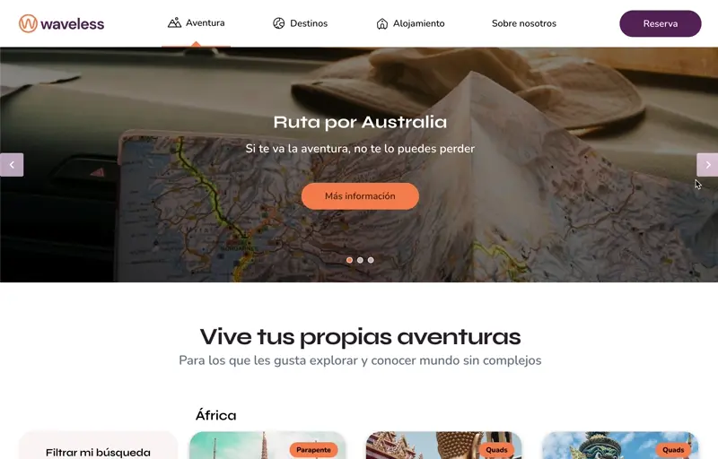
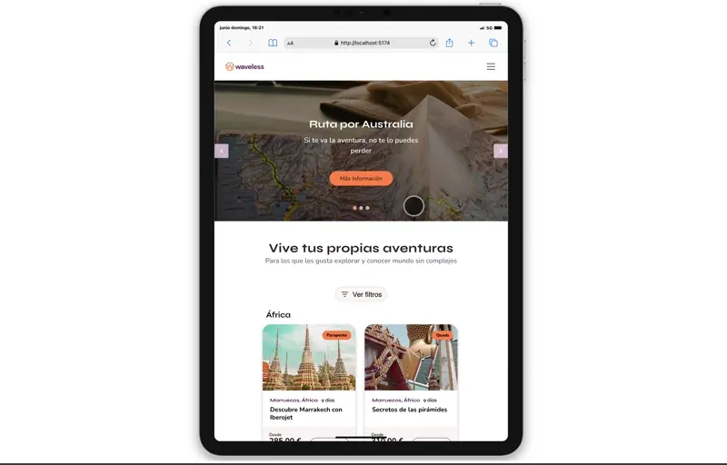
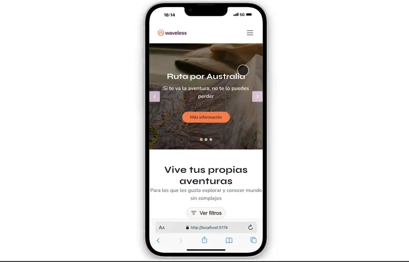

# Avoris PTech Waveless

## Requisitos

### Diseño Responsive

- Escritorio
- Tablet
- Móvil



## Tecnologías Utilizadas

- **HTML5**: Estructuración semántica.
- **Sass**: Preprocesador CSS para facilitar la organización y modularidad de estilos.
- **JavaScript (ES6+)**: Para la lógica y la interacción.
- **GSAP**: Biblioteca para animaciones avanzadas y fluidas, utilizada para mejorar la experiencia de usuario en las transiciones y animaciones de elementos.
- **Vite**: Herramienta moderna para bundling y servidor de desarrollo rápido.
- **Git**: Control de versiones para gestionar el código fuente y su historial.

---



## Funcionalidades Destacadas

### Alineamiento Dinámico del Modal

El modal se posiciona dinámicamente para asegurar que siempre quede dentro del viewport, evitando que quede cortado o fuera de la pantalla, mejorando la usabilidad en diferentes resoluciones y dispositivos.

### Animaciones con GSAP

- Animar la apertura y cierre de filtros y menús.
- Transiciones suaves en elementos interactivos.
- Sincronización de animaciones para un mejor control visual.

---



## Cómo visualizar el proyecto en local

Para correr el proyecto en tu equipo local, sigue estos pasos:

1. **Clonar el repositorio**:

```bash
   git clone https://github.com/nesmanpro/avoris-ptech-waveless.git
   cd avoris-ptech-waveless
```

2. **Instalar las dependencias**:

```bash
   npm install
```

3. **Iniciar el servidor de desarrollo**:

```bash
   npm run dev
```
